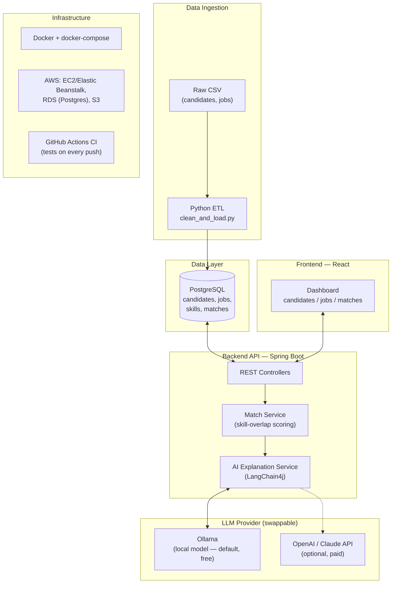

# Architecture

## Overview

TalentMatch AI is composed of four independent pieces that communicate over
well-defined interfaces: a data pipeline that populates the database, an API
that serves data and computes matches, an AI layer that explains matches, and
a frontend that presents everything to a user.

## System Diagram

## Component Responsibilities

| Component | Responsibility | Owns |
|---|---|---|
| Python ETL | Validate, clean, and load raw candidate/job data | Data quality at ingestion |
| PostgreSQL | Single source of truth for candidates, jobs, skills, matches | Data persistence |
| Spring Boot API | Expose REST endpoints, run matching logic, orchestrate AI calls | Business logic |
| AI Explanation Service | Use LangChain4j's `AiServices` to call the configured LLM provider and return a typed response for storage/display | Match explanations |
| LLM Provider | Ollama (local, free) by default; OpenAI/Claude API optional, swappable via config for higher-quality output | Natural-language generation |
| React Frontend | Present candidates, jobs, and match results to a user | User interface |
| Docker / AWS | Package and run every component consistently, locally and in the cloud | Deployment |

## Data Flow (a single match request)

1. User opens the dashboard and selects a job.
2. Frontend calls `GET /api/jobs/{id}/matches`.
3. Spring Boot loads the job and all candidates from PostgreSQL.
4. Match Service scores each candidate against the job's required skills.
5. For the top-scoring candidates, the AI Explanation Service uses LangChain4j's
   `AiServices` to call the configured LLM provider (Ollama locally by default)
   with the candidate and job details, and gets back a typed response containing
   a short plain-English reason.
6. API returns match scores plus explanations to the frontend.
7. Frontend renders the ranked list with each explanation.

## AI Tooling and Provider Choice

The AI Explanation Service is built with **LangChain4j**, a Java library for
integrating LLMs into JVM applications. Rather than hand-rolling an HTTP client
against a specific provider's API, LangChain4j's `AiServices` abstraction lets
the service be defined as a plain Java interface — the method signature and a
prompt template describe what's needed, and LangChain4j handles the prompt
construction, the call, and parsing the response into a typed Java object.

**Provider is swappable, not hardcoded.** The service is configured against
**Ollama** (running a local open-source model) by default, and can be switched
to a hosted provider (OpenAI or Claude) via a single configuration change —
no code changes required, since both are just different `ChatModel`
implementations behind the same interface.

This is a deliberate cost and reliability decision, not just a technical
preference:

- **Ollama by default keeps the project free to build, run, and demo** — no
  API key, no billing risk, no card on file. The whole system, including the
  AI layer, can be developed and shown end-to-end at zero cost.
- **Hosted providers remain a config swap away** for anyone who wants
  higher-quality output than a local model can currently produce — useful for
  a final polished demo, without changing the architecture or code.
- This mirrors a real production concern: teams often start integration
  against a cheap or local model during development, and only pay for a
  premium hosted model where output quality genuinely matters (e.g. staging
  vs. production, or a cost-sensitive feature vs. a customer-facing one).

## Why This Shape

- **Separating ETL from the API** mirrors how real data platforms work: ingestion
  is a distinct, testable concern from serving.
- **The AI layer sits behind the Match Service**, not in front of it — matching
  logic is deterministic and testable; AI is used only to *explain*, not to decide.
  This keeps the core system reliable even if the LLM API is slow or unavailable
  (the explanation can degrade gracefully; the match score cannot).
- **Docker + docker-compose** lets the whole stack run identically on a laptop
  and in CI, before it ever touches AWS.
