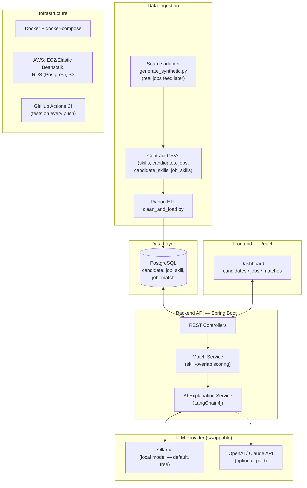

# Architecture

## Overview

TalentMatch AI is composed of four independent pieces that communicate over
well-defined interfaces: a data pipeline that populates the database, an API
that serves data and computes matches, an AI layer that explains matches, and
a frontend that presents everything to a user.

## System Diagram

```mermaid
flowchart TB
    subgraph Ingestion["Data Ingestion"]
        GEN["Source adapter\ngenerate_synthetic.py\n(real jobs feed later)"]
        RAW["Contract CSVs\n(skills, candidates, jobs,\ncandidate_skills, job_skills)"]
        ETL["Python ETL\nclean_and_load.py"]
        GEN --> RAW
        RAW --> ETL
    end

    subgraph Data["Data Layer"]
        DB[("PostgreSQL\ncandidate, job, skill,\njob_match")]
    end

    subgraph Backend["Backend API — Spring Boot"]
        API["REST Controllers"]
        SVC["Match Service\n(skill-overlap scoring)"]
        AI["AI Explanation Service\n(LangChain4j)"]
        API --> SVC
        SVC --> AI
    end

    subgraph External["LLM Provider (swappable)"]
        OLLAMA["Ollama\n(local model — default, free)"]
        HOSTED["OpenAI / Claude API\n(optional, paid)"]
    end

    subgraph Frontend["Frontend — React"]
        UI["Dashboard\ncandidates / jobs / matches"]
    end

    ETL --> DB
    DB <--> API
    AI <--> OLLAMA
    AI -.-> HOSTED
    UI <--> API

    subgraph Infra["Infrastructure"]
        DOCKER["Docker + docker-compose"]
        AWS["AWS: EC2/Elastic Beanstalk,\nRDS (Postgres), S3"]
        CI["GitHub Actions CI\n(tests on every push)"]
    end
```

## Component Responsibilities

| Component | Responsibility | Owns |
|---|---|---|
| Python ETL (`scripts/etl/`) | Produce raw contract CSVs via source adapters, then validate, clean, and idempotently load them | Data quality at ingestion |
| PostgreSQL | Single source of truth for candidates, jobs, skills, and `job_match` results | Data persistence |
| Spring Boot API | Expose REST endpoints, run matching logic, orchestrate AI calls | Business logic |
| AI Explanation Service | Use LangChain4j's `AiServices` to call the configured LLM provider and return a typed response for storage/display | Match explanations |
| LLM Provider | Ollama (local, free) by default; OpenAI/Claude API optional, swappable via config for higher-quality output | Natural-language generation |
| React Frontend | Present candidates, jobs, and match results to a user | User interface |
| Docker / AWS | Package and run every component consistently, locally and in the cloud | Deployment |

## Data Ingestion (`scripts/etl/`)

1. A **source adapter** writes contract CSVs (`skills.csv`, `candidates.csv`,
   `jobs.csv`, `candidate_skills.csv`, `job_skills.csv`) into a raw directory.
   Today the only adapter is the seeded Faker generator,
   `scripts/etl/generate_synthetic.py`, which can also inject known defects
   for testing the cleaner.
2. `scripts/etl/clean_and_load.py` reads that directory, validates and
   normalizes the rows, writes a rejects report (`rejects.csv`,
   `summary.json`), and upserts the clean rows into PostgreSQL. Reruns with
   the same input change nothing.

Adapters implement the `talentmatch_etl.sources.base.SourceAdapter` protocol
and may write only a subset of the files (missing files are read as empty).
This lets a real job-postings source be added later without changing the
cleaner or loader.

## Backend Package Layering (`src/main/java/com/talentmatch/`)

| Package | Responsibility | Depends on |
|---|---|---|
| `web.controller` | HTTP mapping under `/api`, query-param validation (`@Validated`) | `service` |
| `web.dto` | request/response records, `PageResponse<T>` | — |
| `web.error` | `ApiError`, `ErrorCode`, `GlobalExceptionHandler`, `/error` attributes, `RequestIdFilter` | `service.exception` |
| `service` | use cases, transactions, normalization (`TextNormalizer`), skill resolution, match caching, batch recompute | `repository`, `domain` |
| `repository` | Spring Data JPA repositories (CRUD, list projections) and `MatchJdbcRepository` (set-based match SQL) | `domain.entity` |
| `domain.entity` | JPA entities matching the Flyway schema (`ddl-auto=validate`) | — |
| `domain.scoring` | **pure** `ScoringEngine` (no Spring, no JPA): score, breakdown, summary | — |
| `config` | typed properties (`talentmatch.*`), executor, startup failure analyzer | — |

The schema is owned by Flyway; Hibernate only validates it. `job_match` is read through
JDBC/JPA but written only by one SQL upsert.

## Data Flow (a single match request)

1. User opens the dashboard and selects a job.
2. Frontend calls `GET /api/jobs/{id}/matches`.
3. In one read-write transaction (READ COMMITTED) the Match Service loads the job (404 if
   missing) and its skills. A job with no skills returns `matchable: false` immediately;
   nothing is written.
4. **Staleness check:** one query finds candidates with no `job_match` row or with
   `computed_at < GREATEST(candidate.updated_at, job.updated_at)` (V2 triggers bump
   `updated_at` on any skill-link change). `regenerate=true` targets every candidate.
5. If anything is stale: `SET LOCAL lock_timeout = '10s'`, then
   `pg_advisory_xact_lock(hashtextextended('job_match:' || jobId, 0))` serializes recomputes of
   this job (a timeout returns `503 MATCHES_BUSY`). The job, its skills and the stale set are
   re-read under the lock, so a request that waited for a concurrent recompute usually finds
   nothing left to do.
6. One query loads the targets' relevant `candidate_skill` rows; the pure `ScoringEngine`
   scores them in memory; one chunked upsert (`unnest` arrays, 5000 rows per statement)
   writes scores with `computed_at = now()`. Query count per request is constant.
7. The ranked page (`score DESC, full_name, id`, `minScore`, `LIMIT/OFFSET`) and its count are
   read; the breakdown and summary are recomputed for that page only (not stored). If a cached
   score differs from the engine (weights changed), a WARN is logged.
8. *(Phase 3)* For the top-scoring candidates, the AI Explanation Service uses LangChain4j's
   `AiServices` to call the configured LLM provider (Ollama locally by default)
   with the candidate and job details, and gets back a typed response containing
   a short plain-English reason. In Phase 2 `aiExplanation` is always `null` and
   `explanationStatus` is `UNAVAILABLE`.
9. API returns match scores (plus explanations, from Phase 3) to the frontend.
10. Frontend renders the ranked list with each explanation.

**Batch recompute** (`POST /api/matches/recompute`): returns `202` with a run resource and
runs on a single background thread (one run at a time; a second request gets `409`). It
snapshots job ids, then calls the same per-job recompute (lock → stale/all targets → facts →
evaluate → upsert) in a separate transaction per job, recording per-job failures without
stopping. Run status is kept in memory (last 20 runs).

## AI Tooling and Provider Choice

The AI Explanation Service is built with **LangChain4j**, a Java library for
integrating LLMs into JVM applications. Rather than hand-rolling an HTTP client
against a specific provider's API, LangChain4j's `AiServices` abstraction lets
the service be defined as a plain Java interface — the method signature and a
prompt template describe what's needed, and LangChain4j handles the prompt
construction, the call, and parsing the response into a typed Java object.

**Provider is swappable, not hardcoded.** The service is configured against
**Ollama** (running a local open-source model) by default, and can be switched
to a hosted provider (OpenAI or Claude) via a single configuration change —
no code changes required, since both are just different `ChatModel`
implementations behind the same interface.

This is a deliberate cost and reliability decision, not just a technical
preference:

- **Ollama by default keeps the project free to build, run, and demo** — no
  API key, no billing risk, no card on file. The whole system, including the
  AI layer, can be developed and shown end-to-end at zero cost.
- **Hosted providers remain a config swap away** for anyone who wants
  higher-quality output than a local model can currently produce — useful for
  a final polished demo, without changing the architecture or code.
- This mirrors a real production concern: teams often start integration
  against a cheap or local model during development, and only pay for a
  premium hosted model where output quality genuinely matters (e.g. staging
  vs. production, or a cost-sensitive feature vs. a customer-facing one).

## Why This Shape

- **Separating ETL from the API** mirrors how real data platforms work: ingestion
  is a distinct, testable concern from serving.
- **The AI layer sits behind the Match Service**, not in front of it — matching
  logic is deterministic and testable; AI is used only to *explain*, not to decide.
  This keeps the core system reliable even if the LLM API is slow or unavailable
  (the explanation can degrade gracefully; the match score cannot).
- **Docker + docker-compose** lets the whole stack run identically on a laptop
  and in CI, before it ever touches AWS.
