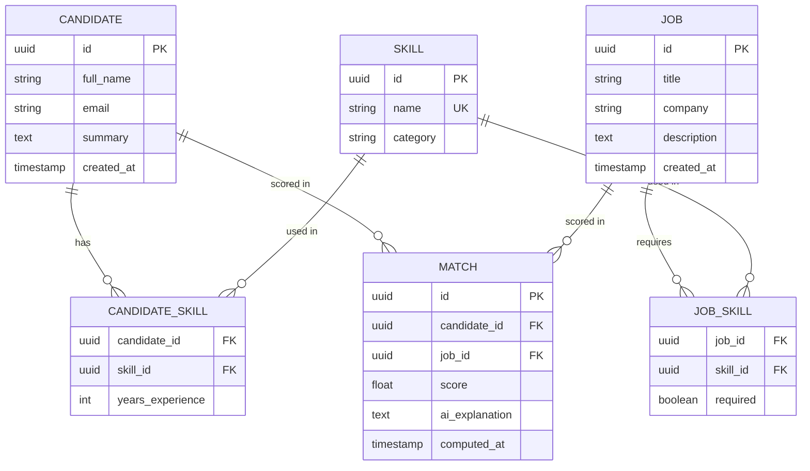

# Data Model

## Entity-Relationship Diagram

## Table Notes

### `candidate`
Core candidate record. `summary` is free text (e.g. a short bio) used as
context when generating AI explanations.

### `job`
Core job record. `description` provides context for AI explanations in the
same way `candidate.summary` does.

### `skill`
A normalized skill lookup table (e.g. "Java", "SQL", "React") shared between
candidates and jobs, so matching is done on a consistent vocabulary rather
than free-text string comparison.

### `candidate_skill` / `job_skill`
Join tables linking candidates and jobs to their skills. `job_skill.required`
distinguishes must-have skills from nice-to-have, which feeds directly into
the match scoring weights.

### `match`
A computed, persisted result: a score between a candidate and a job, plus the
AI-generated explanation for that score. Persisting matches (rather than only
computing on demand) means explanations aren't re-generated — and re-billed —
every time the dashboard is opened.

## Design Decisions

- **Why normalize skills into their own table** instead of storing them as
  text arrays on candidate/job: it enables consistent matching logic and
  makes "find all candidates with skill X" a simple join instead of a text
  search.
- **Why persist `match` rows** instead of computing scores live on every
  request: keeps the AI Explanation Service's LLM calls cheap and fast to
  re-display, and gives a natural place to add a "recompute matches" endpoint
  later without changing the read path.
- **UUID primary keys** throughout, rather than auto-increment integers, since
  this mirrors patterns used in most production systems working with
  externally-referenced or eventually-distributed data.
