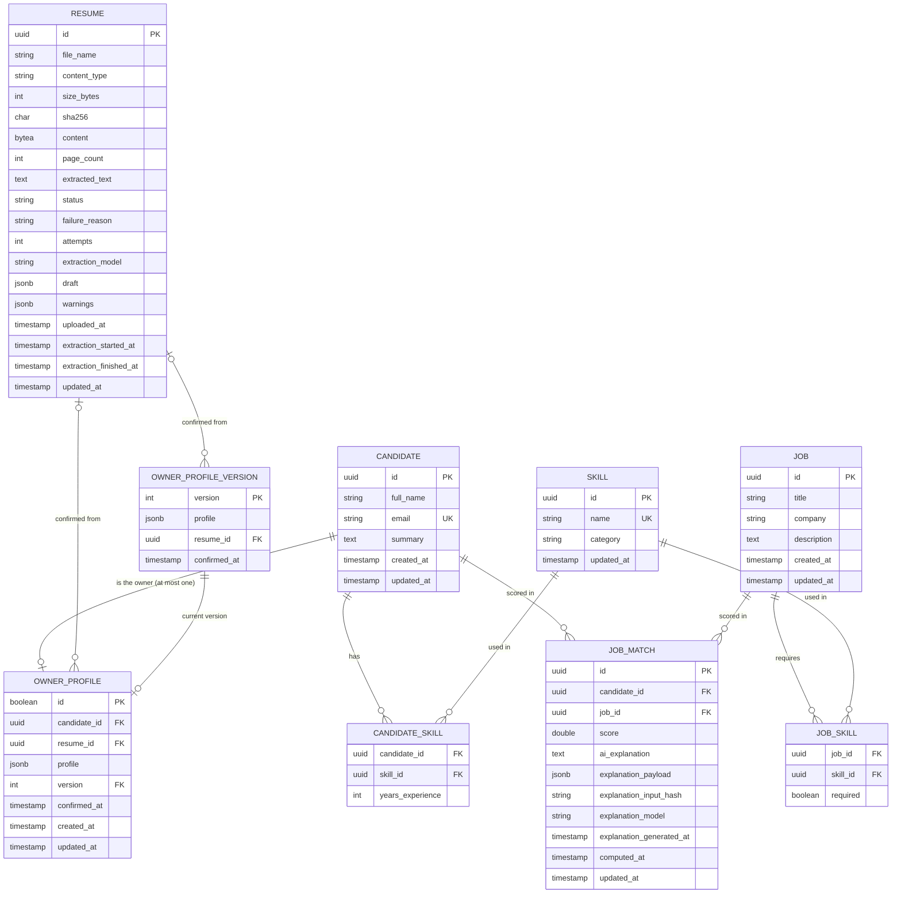

# Data Model

The schema is created by the Flyway migrations in `src/main/resources/db/migration/`
(PostgreSQL 16):

- `V1__init_schema.sql`: tables, constraints, indexes, `set_updated_at()` triggers.
- `V2__skill_link_staleness.sql`: link-touch triggers that make skill changes visible to
  match staleness (see below).
- `V3__match_explanation.sql`: persisted AI explanations with prompt-hash staleness
  (Phase 3; see "AI explanations" below).
- `V4__owner_profile.sql`: uploaded CVs (`resume`) and the owner's confirmed master profile
  (`owner_profile`) (Phase 4; see "Master profile" below).

## Entity-Relationship Diagram


```mermaid
erDiagram
    CANDIDATE ||--o{ CANDIDATE_SKILL : has
    SKILL ||--o{ CANDIDATE_SKILL : "used in"
    JOB ||--o{ JOB_SKILL : requires
    SKILL ||--o{ JOB_SKILL : "used in"
    CANDIDATE ||--o{ JOB_MATCH : "scored in"
    JOB ||--o{ JOB_MATCH : "scored in"
    CANDIDATE ||--o| OWNER_PROFILE : "is the owner (at most one)"
    RESUME |o--o{ OWNER_PROFILE : "confirmed from"
    OWNER_PROFILE_VERSION ||--o| OWNER_PROFILE : "current version"
    RESUME |o--o{ OWNER_PROFILE_VERSION : "confirmed from"

    CANDIDATE {
        uuid id PK
        string full_name
        string email UK
        text summary
        timestamp created_at
        timestamp updated_at
    }

    JOB {
        uuid id PK
        string title
        string company
        text description
        timestamp created_at
        timestamp updated_at
    }

    SKILL {
        uuid id PK
        string name UK
        string category
        timestamp updated_at
    }

    CANDIDATE_SKILL {
        uuid candidate_id FK
        uuid skill_id FK
        int years_experience
    }

    JOB_SKILL {
        uuid job_id FK
        uuid skill_id FK
        boolean required
    }

    JOB_MATCH {
        uuid id PK
        uuid candidate_id FK
        uuid job_id FK
        double score
        text ai_explanation
        jsonb explanation_payload
        string explanation_input_hash
        string explanation_model
        timestamp explanation_generated_at
        timestamp computed_at
        timestamp updated_at
    }

    RESUME {
        uuid id PK
        string file_name
        string content_type
        int size_bytes
        char sha256
        bytea content
        int page_count
        text extracted_text
        string status
        string failure_reason
        int attempts
        string extraction_model
        jsonb draft
        jsonb warnings
        timestamp uploaded_at
        timestamp extraction_started_at
        timestamp extraction_finished_at
        timestamp updated_at
    }

    OWNER_PROFILE {
        boolean id PK
        uuid candidate_id FK
        uuid resume_id FK
        jsonb profile
        int version FK
        timestamp confirmed_at
        timestamp created_at
        timestamp updated_at
    }

    OWNER_PROFILE_VERSION {
        int version PK
        jsonb profile
        uuid resume_id FK
        timestamp confirmed_at
    }
```

## Table Notes

### `candidate`
Core candidate record. `summary` is free text (e.g. a short bio) used as
context when generating AI explanations. `email` is the natural key: it must
be stored normalized (lowercase and trimmed, enforced by a check constraint)
and is unique.

### `job`
Core job record. `description` provides context for AI explanations in the
same way `candidate.summary` does. The pair `(title, company)` is unique.

### `skill`
A normalized skill lookup table (e.g. "Java", "SQL", "React") shared between
candidates and jobs, so matching is done on a consistent vocabulary rather
than free-text string comparison. Names are stored trimmed and are unique
case-insensitively, via a unique index on `lower(name)`.

### `candidate_skill` / `job_skill`
Join tables linking candidates and jobs to their skills, keyed by
`(candidate_id, skill_id)` and `(job_id, skill_id)`.
`candidate_skill.years_experience` is optional but must be `>= 0` (the ETL
also caps it at 60). `job_skill.required` (default `true`) distinguishes
must-have skills from nice-to-have, which feeds directly into the match
scoring weights.

### `job_match`
A computed, persisted result: a score between a candidate and a job, plus the
AI-generated explanation for that score. Persisting matches (rather than only
computing on demand) means explanations aren't re-generated — and re-billed —
every time the dashboard is opened. There is at most one row per
`(candidate_id, job_id)` pair (unique constraint), and `score` is a
`double precision` constrained to `[0, 1]`.

`job_match` is written **only** by the API's set-based upsert
(`INSERT ... SELECT FROM unnest(...) ON CONFLICT (candidate_id, job_id) DO UPDATE SET score,
computed_at`), never through JPA. `computed_at` means "verified fresh at": every upsert
advances it to `now()`, even when the score is unchanged. `ai_explanation` and the V3
`explanation_*` columns are never touched by the upsert; they are written only by the guarded
explanation `UPDATE` (below).

### AI explanations (V3)

| Column | Type | Meaning |
|---|---|---|
| `ai_explanation` (V1) | `text` | the AI explanation text (`NULL` = none) |
| `explanation_payload` | `jsonb` | validated AI output `{headline, explanation, strengths[], gaps[]}` |
| `explanation_input_hash` | `char(64)` | sha256 hex of the exact prompt (system + user message) it was generated from |
| `explanation_model` | `varchar(200)` | provider/model label, e.g. `ollama/qwen2.5:7b-instruct` |
| `explanation_generated_at` | `timestamptz` | when it was generated |

Check constraint `ck_job_match_explanation_complete`: all five columns are `NULL`, or all are
set (non-blank text, a JSON object payload, a 64-char lower-case hex hash, a non-blank model
and a timestamp). An explanation is never partially recorded. The new columns are not mapped
in the `JobMatch` entity (`validate` ignores unmapped columns).

**Explanation staleness rule (not `computed_at`).** A stored explanation is *fresh* iff
`explanation_input_hash` equals the hash of the prompt the API would send now. If
`ai_explanation` is set but the hash differs, the explanation is `STALE`. `computed_at` is
deliberately not used: every score refresh advances it, even when nothing changed. Any change
the model would see (candidate name/summary/skills, job title/company/description/skills,
score, truncated context, system prompt) changes the hash; changes it never sees (email, text
beyond the truncation point, `computed_at`, the model) do not. Rows whose payload cannot be
parsed are treated as having no explanation.

**Guarded write.** Explanations are generated outside the scoring transaction and saved with
one autocommit statement:

```sql
UPDATE job_match m SET ai_explanation = …, explanation_payload = CAST(… AS jsonb), …
  FROM candidate c, job j
 WHERE m.job_id = :jobId AND m.candidate_id = :candidateId
   AND c.id = m.candidate_id AND j.id = m.job_id
   AND c.updated_at = :candidateUpdatedAt AND j.updated_at = :jobUpdatedAt
   AND m.score = :expectedScore
```

The timestamps and score are the values read with the page. Equality detects any committed
edit of the candidate, the job or their skill links (V2 triggers), and any rescore, so an
explanation generated from outdated inputs is discarded (0 rows) instead of stored.

### Master profile (V4)

Both tables hold the owner's personal data (PII; PRODUCTION_READINESS section 11). They are
read and written through JDBC (`profile.ResumeRepository`, `profile.OwnerProfileRepository`),
not JPA, because of the `jsonb` and `bytea` columns.

**`resume`**: one row per uploaded CV.
- `content` is the original PDF (`bytea`); `size_bytes = octet_length(content)` (CHECK).
  `sha256` (indexed) finds a re-upload of the same file: a non-FAILED row is reused instead of
  extracted again. Concurrent uploads of one file are serialized with
  `pg_advisory_xact_lock(hashtext('talentmatch.resume:' || sha256))`.
- `extracted_text` is the PDF's text layer as sent to the model (NFKC-normalized, format
  characters removed).
- `status`: `PENDING` (queued) → `RUNNING` (model reading it) → `SUCCEEDED` | `FAILED`.
  Every transition is a guarded `UPDATE … WHERE status = …`, so two workers never own one
  CV. A manual retry puts `FAILED`/`SUCCEEDED` back to `PENDING`.
- CHECKs: `failure_reason` is set exactly when `FAILED` and is one of `AI_DISABLED`, `TIMEOUT`,
  `PROVIDER_ERROR`, `REFUSED`, `INVALID_OUTPUT`, `QUEUE_FULL`, `CONTEXT_OVERFLOW`,
  `TOO_MANY_ATTEMPTS`, `REMOTE_EXTRACTION_DISABLED` (the Java enum `ExtractionFailure`); `draft` (an object) and `warnings`
  (an array) are set exactly when `SUCCEEDED`, together with `extraction_model`; `RUNNING`
  needs `extraction_started_at`. Every CHECK uses explicit `IS NOT NULL` (a CHECK that
  evaluates to NULL passes).
- `attempts` counts claims since upload or the last manual retry. After 3 (e.g. the app was
  stopped or crashed mid-extraction three times) the CV becomes `FAILED/TOO_MANY_ATTEMPTS`
  instead of being re-run on every start.
- `draft` and `warnings` are the AI-extracted `ProfileDocument` and the grounding warnings
  (`path`, `value`, `message`) for the owner to review.

**`owner_profile`**: a single row (`id boolean PRIMARY KEY CHECK (id)`): the confirmed
master profile.
- `profile` is the reviewed `ProfileDocument` (`jsonb`).
- `candidate_id` (UNIQUE) is the owner's `candidate` row, kept in sync on every save (name,
  email, headline + summary, skills with years), so scoring and matching treat the owner
  like any candidate. `ON DELETE RESTRICT`: deleting that candidate must never silently
  delete the profile; the API answers `409` first.
- `resume_id` is the CV the profile came from; `ON DELETE SET NULL` when that upload is
  deleted (the confirmed profile stays).
- Saves are serialized with `pg_advisory_xact_lock(hashtext('talentmatch.owner_profile'))`,
  taken before reading the row, so two first saves cannot create two owner candidates.
- `version` references the current row of `owner_profile_version`.

**`owner_profile_version`**: append-only history, one row per successful save
(`version` 1, 2, 3, … = MAX + 1 under the save lock), with the saved `profile`, its `resume_id`
and `confirmed_at` (equal to `owner_profile.confirmed_at` for the current version). A trigger
(`owner_profile_version_append_only`) refuses every `DELETE` and every `UPDATE` except the
foreign key's own `ON DELETE SET NULL` of `resume_id` when an upload is deleted. Phase 7 will
record which version a tailored CV was built from; Phase 5 refreshes the watchlist when the
current version changes.

### `updated_at` and the `set_updated_at()` trigger
`candidate`, `job`, `skill`, `job_match`, `resume` and `owner_profile` each have an `updated_at`
column. A shared `set_updated_at()` trigger function sets it to `now()` on
every `UPDATE`, so it stays correct even when the ETL's
`ON CONFLICT DO UPDATE` upserts don't set it explicitly.

### Link-touch triggers (V2) and match staleness
`candidate_skill` / `job_skill` have no timestamps of their own. V2 adds statement-level
`AFTER INSERT / UPDATE / DELETE` triggers (one per event, using transition tables
`new_links` / `old_links`) that bump the parent's `updated_at` whenever a link row really
changes:

- `trg_candidate_skill_touch_{ins,upd,del}` → `touch_candidate_from_links()`
- `trg_job_skill_touch_{ins,upd,del}` → `touch_job_from_links()`

One parent `UPDATE` runs per statement. Statements touching zero rows (no-op ETL reruns,
whose conditional `DO UPDATE ... WHERE` and prune `DELETE` affect nothing) bump nothing. The
`updated_at IS DISTINCT FROM now()` guard skips parents already touched in the same
transaction (e.g. a candidate inserted together with its links). Deleting a skill cascades
to its links and therefore bumps every affected candidate and job. Because triggers live in
the database, they catch both writers: the API and the ETL.

**Staleness rule.** A `job_match` row is stale when

```
computed_at < GREATEST(candidate.updated_at, job.updated_at)
```

and a missing row counts as stale. The API recomputes stale rows on read
(`GET /jobs/{id}/matches`) or in batch (`POST /matches/recompute`).

## Match Scoring Rule

Each of the job's skills is worth points: by default a **required** skill is worth
**10 points** and a **nice-to-have** skill **5 points** (configurable via
`talentmatch.scoring.required-weight` / `nice-to-have-weight`, validated at startup). A
candidate earns a skill's points if they have that skill; extra candidate skills and years
of experience do not affect the score. The stored score is normalized:

```
score = earned points / max points   (0..1)
```

A job with no skills is **not matchable**: it is never scored (no `0/0`, no rows written),
and the API returns an explicit `JOB_HAS_NO_SKILLS` state. Changing the weights does not mark
rows stale; run `POST /api/matches/recompute` afterwards.

## Design Decisions

- **Why normalize skills into their own table** instead of storing them as
  text arrays on candidate/job: it enables consistent matching logic and
  makes "find all candidates with skill X" a simple join instead of a text
  search.
- **Why persist `job_match` rows** instead of computing scores live on every
  request: keeps the AI Explanation Service's LLM calls cheap and fast to
  re-display, and gives a natural place to add a "recompute matches" endpoint
  later without changing the read path.
- **UUID primary keys** throughout, rather than auto-increment integers, since
  this mirrors patterns used in most production systems working with
  externally-referenced or eventually-distributed data.
- **Natural-key unique constraints** (normalized email, `(title, company)`,
  `lower(skill.name)`) let the ETL upsert idempotently: reloading the same
  input changes nothing.
