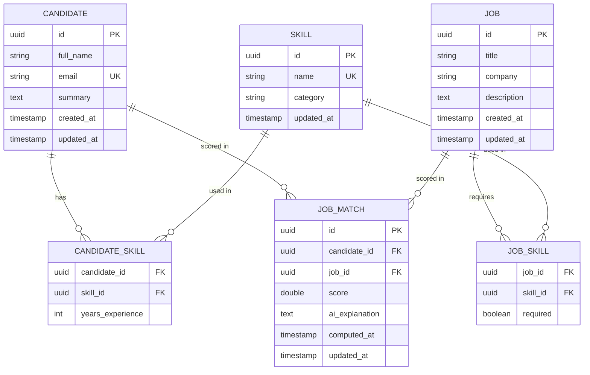

# Data Model

The schema is created by the Flyway migration
`src/main/resources/db/migration/V1__init_schema.sql` (PostgreSQL 16).

## Entity-Relationship Diagram


```mermaid
erDiagram
    CANDIDATE ||--o{ CANDIDATE_SKILL : has
    SKILL ||--o{ CANDIDATE_SKILL : "used in"
    JOB ||--o{ JOB_SKILL : requires
    SKILL ||--o{ JOB_SKILL : "used in"
    CANDIDATE ||--o{ JOB_MATCH : "scored in"
    JOB ||--o{ JOB_MATCH : "scored in"

    CANDIDATE {
        uuid id PK
        string full_name
        string email UK
        text summary
        timestamp created_at
        timestamp updated_at
    }

    JOB {
        uuid id PK
        string title
        string company
        text description
        timestamp created_at
        timestamp updated_at
    }

    SKILL {
        uuid id PK
        string name UK
        string category
        timestamp updated_at
    }

    CANDIDATE_SKILL {
        uuid candidate_id FK
        uuid skill_id FK
        int years_experience
    }

    JOB_SKILL {
        uuid job_id FK
        uuid skill_id FK
        boolean required
    }

    JOB_MATCH {
        uuid id PK
        uuid candidate_id FK
        uuid job_id FK
        double score
        text ai_explanation
        timestamp computed_at
        timestamp updated_at
    }
```

## Table Notes

### `candidate`
Core candidate record. `summary` is free text (e.g. a short bio) used as
context when generating AI explanations. `email` is the natural key: it must
be stored normalized (lowercase and trimmed, enforced by a check constraint)
and is unique.

### `job`
Core job record. `description` provides context for AI explanations in the
same way `candidate.summary` does. The pair `(title, company)` is unique.

### `skill`
A normalized skill lookup table (e.g. "Java", "SQL", "React") shared between
candidates and jobs, so matching is done on a consistent vocabulary rather
than free-text string comparison. Names are stored trimmed and are unique
case-insensitively, via a unique index on `lower(name)`.

### `candidate_skill` / `job_skill`
Join tables linking candidates and jobs to their skills, keyed by
`(candidate_id, skill_id)` and `(job_id, skill_id)`.
`candidate_skill.years_experience` is optional but must be `>= 0` (the ETL
also caps it at 60). `job_skill.required` (default `true`) distinguishes
must-have skills from nice-to-have, which feeds directly into the match
scoring weights.

### `job_match`
A computed, persisted result: a score between a candidate and a job, plus the
AI-generated explanation for that score. Persisting matches (rather than only
computing on demand) means explanations aren't re-generated — and re-billed —
every time the dashboard is opened. There is at most one row per
`(candidate_id, job_id)` pair (unique constraint), and `score` is a
`double precision` constrained to `[0, 1]`.

### `updated_at` and the `set_updated_at()` trigger
`candidate`, `job`, `skill`, and `job_match` each have an `updated_at`
column. A shared `set_updated_at()` trigger function sets it to `now()` on
every `UPDATE`, so it stays correct even when the ETL's
`ON CONFLICT DO UPDATE` upserts don't set it explicitly.

## Match Scoring Rule

Each of the job's skills is worth points: a **required** skill is worth
**10 points**, a **nice-to-have** skill is worth **5 points**. A candidate
earns a skill's points if they have that skill. The stored score is
normalized:

```
score = earned points / max points   (0..1)
```

## Design Decisions

- **Why normalize skills into their own table** instead of storing them as
  text arrays on candidate/job: it enables consistent matching logic and
  makes "find all candidates with skill X" a simple join instead of a text
  search.
- **Why persist `job_match` rows** instead of computing scores live on every
  request: keeps the AI Explanation Service's LLM calls cheap and fast to
  re-display, and gives a natural place to add a "recompute matches" endpoint
  later without changing the read path.
- **UUID primary keys** throughout, rather than auto-increment integers, since
  this mirrors patterns used in most production systems working with
  externally-referenced or eventually-distributed data.
- **Natural-key unique constraints** (normalized email, `(title, company)`,
  `lower(skill.name)`) let the ETL upsert idempotently: reloading the same
  input changes nothing.
